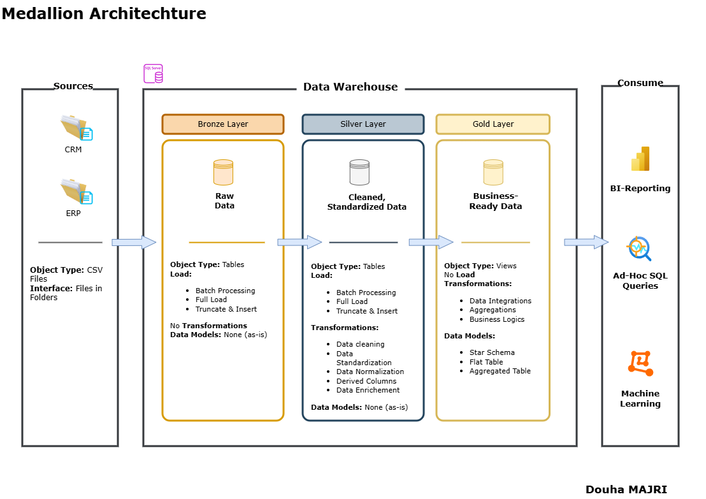
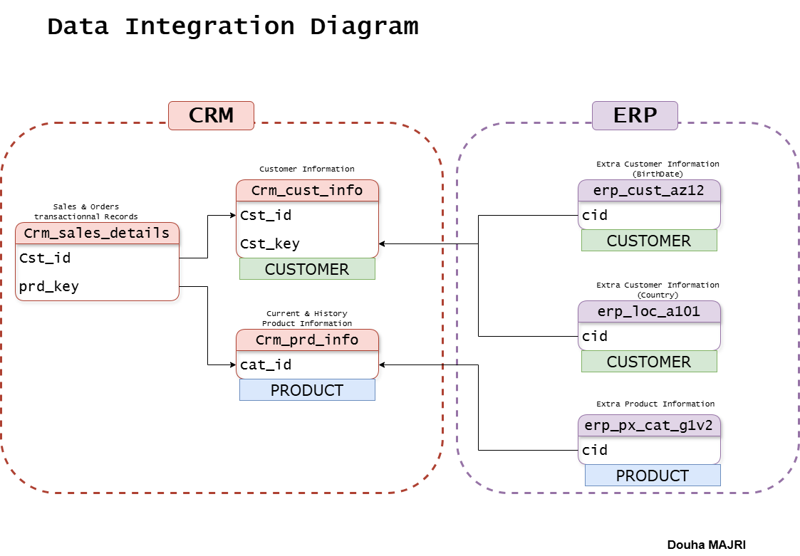
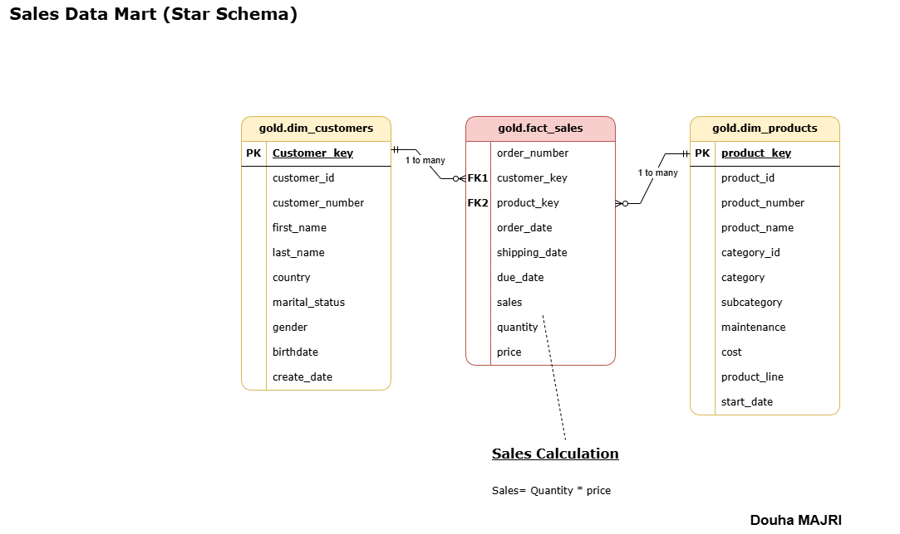

# Enterprise Data Warehouse : Solution Analytics End-to-End (CRM + ERP)

[](https://www.microsoft.com/en-us/sql-server)
[](docs)
[](tests)

## 📌 Résumé Exécutif
Ce projet résout un défi majeur en entreprise : la **fragmentation des données**. L'objectif était de consolider des flux de ventes disparates provenant d'un **ERP** et d'un **CRM** dans une plateforme analytique unique. En implémentant une **Architecture Medallion** sur SQL Server, cette solution transforme des données brutes et incohérentes en une "Source Unique de Vérité" prête pour la Business Intelligence.

**Résultats Clés :**
* **Intégration Transversale :** Réconciliation de +130 000 records entre CRM et ERP.
* **Performance :** Modélisation en étoile (Star Schema) permettant des analyses sub-secondaires.
* **Fiabilité :** Framework de Qualité des Données (DQ) garantissant 100% d'intégrité référentielle.
* **Automatisation :** Pipelines ETL robustes avec gestion d'erreurs et logging de performance.

---

## 🏗️ Architecture des Données
Le projet suit le pattern **Medallion**, standard de l'industrie pour la gestion des cycles de vie de la donnée.


### Les Couches du Warehouse
| Couche | État de la Donnée | Processus Clés |
| :--- | :--- | :--- |
| **Bronze** 🥉 | Raw (Brut) | Ingestion massive (Bulk Insert) sans transformation. |
| **Silver** 🥈 | Cleansed (Propre) | Standardisation, dé-doublonnage, typage et validation DQ. |
| **Gold** 🥇 | Business-Ready | Modèle en étoile (Dim/Fact) optimisé pour le reporting. |

---

## 🛠️ Implémentations Techniques Critiques

### 1. Master Data Management (MDM) & Nettoyage
Le défi principal résidait dans l'incohérence des sources (CRM vs ERP) :



* **Normalisation des IDs :** Suppression des préfixes hétérogènes (`NAS-`, hyphens) pour unifier les clés clients.
* **Harmonisation Catégorielle :** Mapping des valeurs de genre et statuts martiaux.

### 2. Pipeline ETL "Production-Ready"
Développement de procédures stockées modulaires incluant :
* **Gestion de Transactions :** Rollback automatique en cas d'échec du chargement.
* **Observabilité :** Logging automatique des temps d'exécution par table pour le monitoring.
* **Pattern Truncate-and-Load :** Garantie de cohérence pour les rafraîchissements complets.

### 3. Modélisation Dimensionnelle (Gold Layer)
La couche Gold transforme les données nettoyées en un modèle dimensionnel optimisé pour les outils de BI (Power BI, Tableau).



* **Clés Substituées (Surrogate Keys) :** Stabilité des références indépendamment des clés métiers.
* **Historisation (SCD Type 2) :** La dimension Produit suit les changements via `start_date` et `end_date`.
* **Granularité :** Fact table au niveau de la ligne de commande pour une flexibilité analytique maximale.

---

## 📈 Impact Business & Insights
Grâce au modèle en étoile, les décideurs peuvent désormais analyser :
* **Performance Produit :** Rentabilité par catégorie et sous-catégorie.
* **Segmentation Client :** Comportements d'achat basés sur la géographie et la démographie.
* **Efficacité Opérationnelle :** Analyse du cycle de commande (Order date vs Ship date).

**Exemple de Requête Stratégique :**
```sql
-- Top 10 des produits par revenu avec pénétration client
SELECT TOP 10
    p.product_name,
    SUM(f.sales) AS total_revenue,
    COUNT(DISTINCT f.customer_key) AS unique_customers
FROM gold.fact_sales f
JOIN gold.dim_products p ON f.product_key = p.product_key
GROUP BY p.product_name
ORDER BY total_revenue DESC;
## 📂 Structure du Repository

```plaintext
sql-data-warehouse-project/
├── datasets/          # Sources brutes (CRM & ERP)
├── scripts/
│   ├── bronze/        # Ingestion Bulk Insert
│   ├── silver/        # Transformation & Nettoyage
│   └── gold/          # Vues dimensionnelles (Analytics)
├── tests/             # Scripts de validation DQ (Qualité)
├── docs/              # Catalogue de données & Diagrammes d'architecture
└── README.md
```
## 🚀 Installation & Usage

### Prérequis
* **SQL Server 2019+** & **SSMS** (SQL Server Management Studio).
* **Accès administrateur** requis pour la création de la base de données et l'exécution des scripts DDL.

### Mise en route
1.  **Initialisation :** Exécuter le script `scripts/init_database.sql`. Ce script configure la base de données et initialise la structure des schémas (`bronze`, `silver`, `gold`).
2.  **Pipeline de Chargement :** Exécuter les procédures stockées dans l'ordre suivant pour peupler le warehouse :

```sql
-- Étape 1 : Ingestion des données brutes (Landing Zone)
EXEC bronze.load_bronze; 

-- Étape 2 : Nettoyage, standardisation et transformation
EXEC silver.load_silver;
-- Étape 3: Les données sont immédiatement prêtes à être consommées dans le schéma gold via les vues dimensionnelles optimisées.
---
```

## 💡 Compétences Démontrées

### **Data Engineering**
* **Architecture Medallion :** Structuration de flux de données via les couches Bronze, Silver et Gold.
* **Pipelines ETL :** Conception de procédures de chargement automatisées avec gestion de l'idempotence.
* **Bulk Loading :** Ingestion massive de données haute performance depuis des sources CSV.

### **Data Modeling**
* **Modélisation Dimensionnelle :** Conception de schémas en étoile (Star Schema) optimisés pour la BI.
* **Master Data Management (MDM) :** Gestion des clés substituées (Surrogate Keys) et unification des identifiants clients.
* **Historisation :** Implémentation de Slowly Changing Dimensions (SCD Type 2) pour le suivi temporel des attributs.

### **SQL Avancé & Programmation**
* **Logique Complexe :** Maîtrise des CTEs (Common Table Expressions) et des fonctions de fenêtrage (Window Functions).
* **Automatisation :** Création de procédures stockées modulaires et scalables.
* **Robustesse :** Implémentation de la gestion d'erreurs avancée (TRY...CATCH) et monitoring des temps d'exécution.

### **Data Quality & Governance**
* **Validation Automatisée :** Mise en place d'un framework de tests (intégrité référentielle, détection de doublons, validation de formats).
* **Documentation Technique :** Rédaction de catalogues de données et de guides de conventions de nommage.

---

## 👤 Contact

**Douha Majri** *Élève Ingénieure à l'École Centrale Casablanca* *Spécialisée en Analytics Engineering & Data Architecture*

[](www.linkedin.com/in/douha-majri) 
[](https://github.com/Douha-MAJRI)

---
*Dernière mise à jour : Février 2026*
